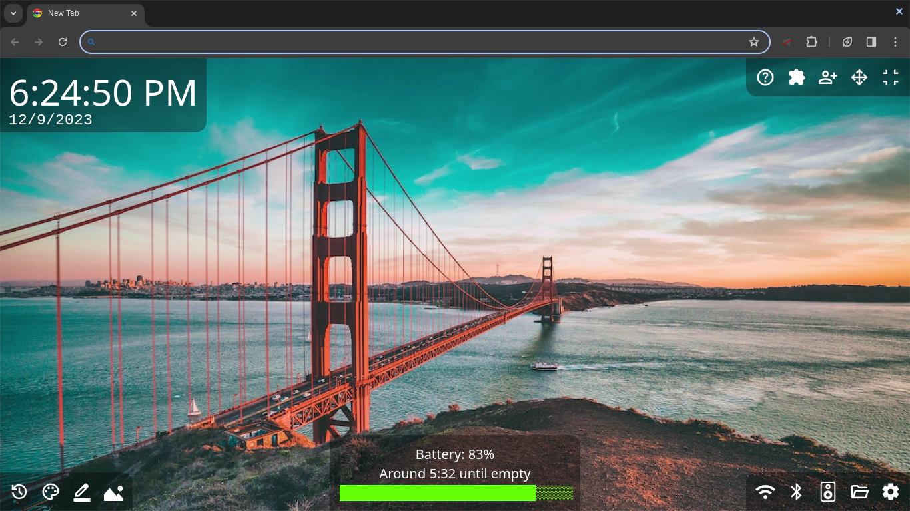

# WARNING
This exploit has been patched!! if you get it working, do not update or log out or else it will fail to work.
# Skiovox Helper (forked ver)

## New features
- No more annoying title and version number
- Battery warning when it only has 15 minutes remaining and 5 minutes remaining
- Settings, WiFi, and Bluetooth link to chrome://os-settings for a smoother experience
- Audio settings button
- UI background alpha color changable
- Battery warnings for 15% and 5% battery globally
- Has default background
## To impliment
Here are the features I am working on:
- Link to change search engine (I recommend bing so I may recommend it in final ver)
- Add a safeguard for Skivox users with single window only to not have the window close
- Add 24 hour mode to clock
- make it look like Chrome's new tab
- Make extention button show battery level in it's icon and show links/settings when clicked
